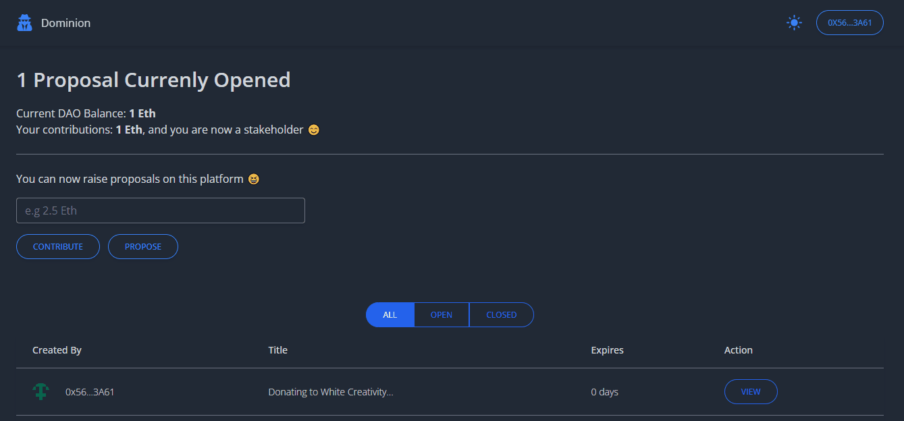

#  Web3.0 DAO with React, Solidity

Web3.0 DAO with React, Solidity, Node , Web3js  , Tailwind CSS


<center><figcaption> DAO</figcaption></center>
A DAO is a governance structure for web3 projects. A DAO typically has a token that allows holders to anonymously vote on what direction the project should take and what changes will be made.
DAOs are programmed to operate autonomously through smart contracts, and there is no hierarchy between the members involved. All decisions in a DAO are usually made by voting, where network members have to reach a consensus for a proposal to be adopted.
As decentralization is at the heart of web3, some projects have abandoned traditional business models in favour of DAOs. DAOs allow projects to pay their developers, give incentives to the community and make critical decisions in a decentralised process.
## Technology

This demo uses:

- Metamask
- Truffle
- Infuria
- ReactJs
- Tailwind CSS
- Ganache-CLI
- Solidity
- Web3js
- Faucet

## Running the demo

To run the demo follow these steps:

1. Clone the project with the code below.
    ```sh

    # Make sure you have the above prerequisites installed already!
    git clone https://github.com/Daltonic/dominionDAO PROVIDER_NAME
    cd PROVIDER_NAME # Navigate to the new folder.
    yarn install # Installs all the dependencies.
    ```
2. Create an Infuria project, copy and paste your key in the spaces below.
3. Update the `.env` file with the following details.
    ```sh
    ENDPOINT_URL=<PROVIDER_URL>
    SECRET_KEY=<SECRET_PHRASE>
    DEPLOYER_KEY=<YOUR_PRIVATE_KEY>
    ```
2. Create a CometChat project, copy and paste your key in the spaces below.
3. Update the `.env` file with the following details.
    ```sh
    REACT_APP_COMET_CHAT_REGION=<REGION>
    REACT_APP_COMET_CHAT_APP_ID=<APP_ID>
    REACT_APP_COMET_CHAT_AUTH_KEY=<AUTH_KEY>
    ```
3. Run the app using `yarn start`
<br/>


- ⚽ [Metamask](https://metamask.io/)
- 🚀 [Remix Editor](https://remix.ethereum.org/)
- 💡 [Truffle](https://trufflesuite.com/)
- 📈 [Infuria](https://infura.io/)
- 🔥 [ReactJs](https://reactjs.org/)
- 🐻 [Solidity](https://soliditylang.org/)
- 👀 [Web3Js](https://docs.ethers.io/v5/)
- 🎅 [Faucet](https://faucets.chain.link/rinkeby)
- 🤖 [Ganache](https://trufflesuite.com/ganache/index.html)
